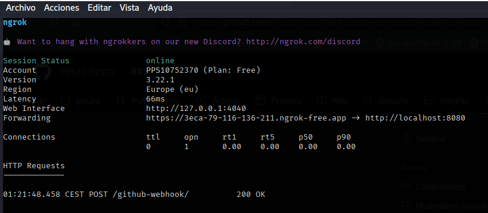
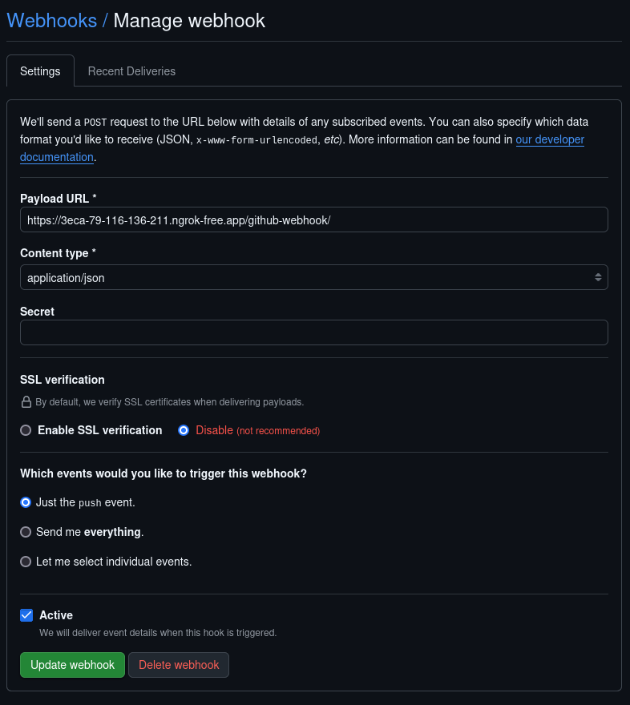
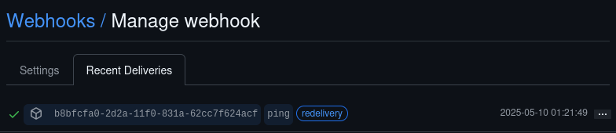
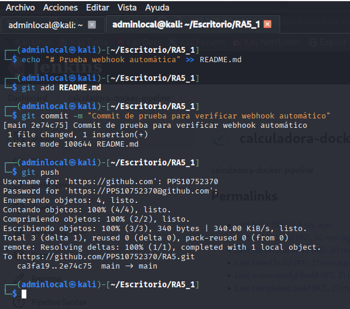
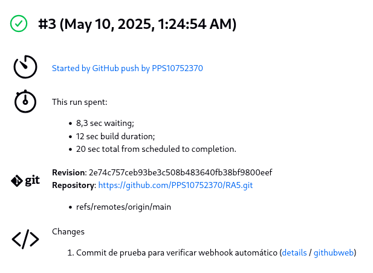
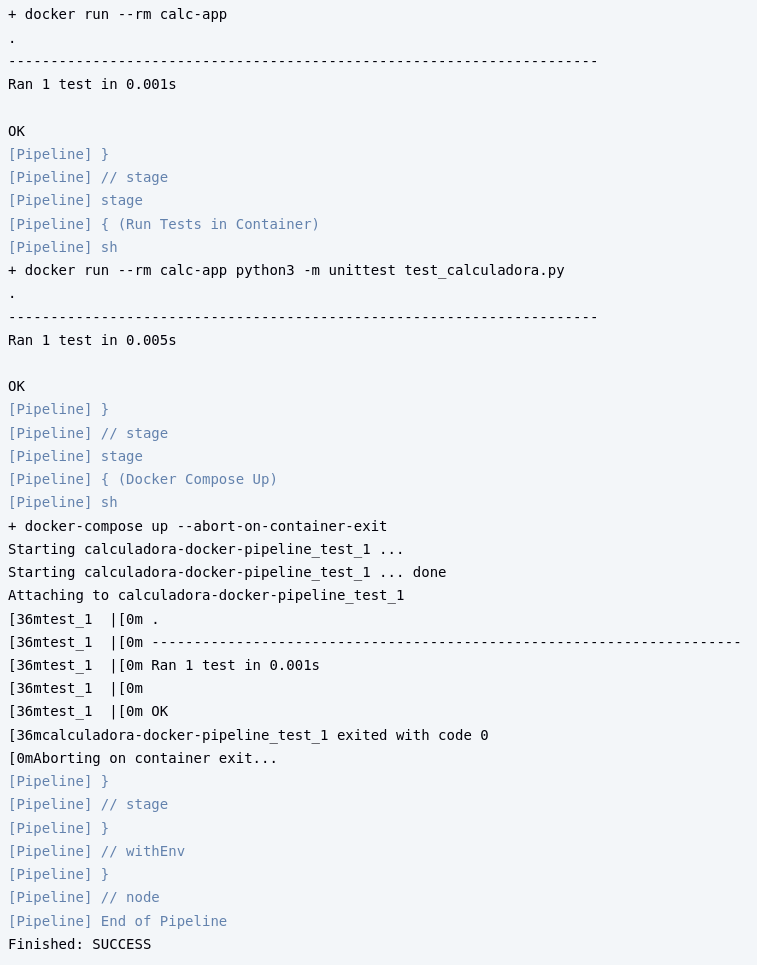
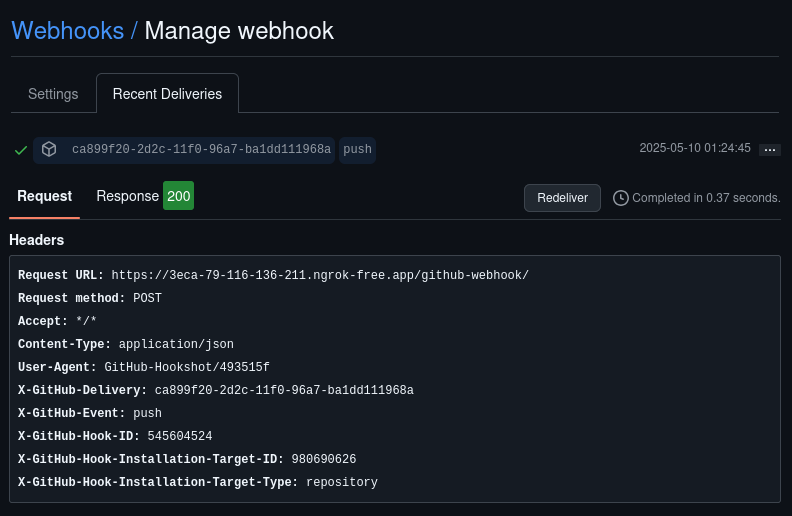
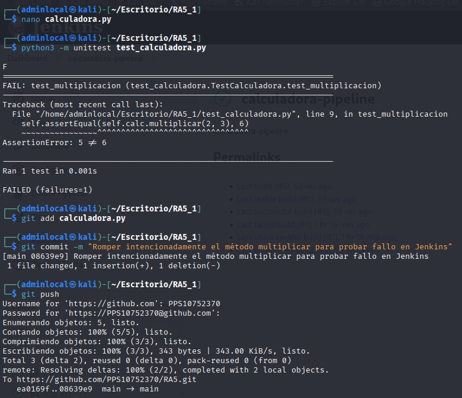
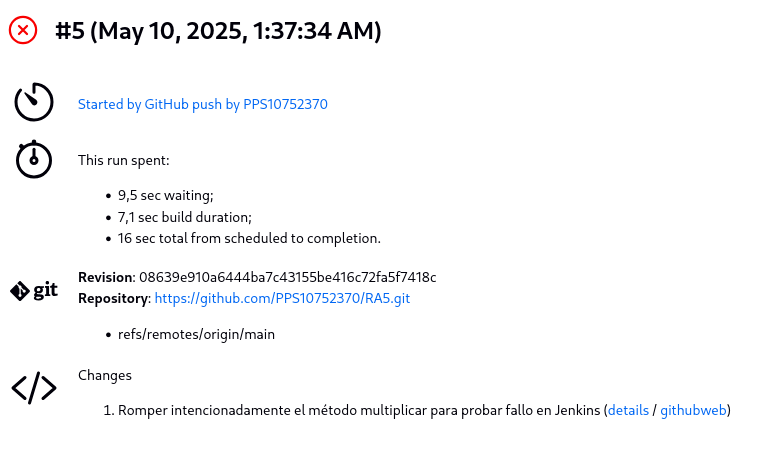
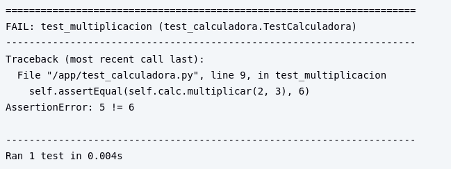

# Proyecto: Calculadora Python con CI/CD usando Jenkins y Webhooks

Este proyecto consiste en una sencilla calculadora escrita en Python que realiza una multiplicación entre dos números, e incluye pruebas unitarias. Se ha integrado con Jenkins para realizar pruebas automáticas en cada `push` al repositorio, usando Docker y Webhooks de GitHub. Además, se utiliza Ngrok para exponer Jenkins a internet de forma segura.

---

## 🛠️ Tecnologías utilizadas

- Python 3
- Unittest
- Jenkins
- Docker
- Docker Compose
- GitHub
- Ngrok (túnel HTTP para Webhooks)
- Webhooks de GitHub

---

## 📁 Estructura del proyecto

```
RA5_1/
│
├── calculadora.py              # Código principal
├── test_calculadora.py         # Pruebas unitarias
├── Jenkinsfile                 # Pipeline básico (sin Docker)
├── Jenkinsfile.docker          # Pipeline completo con Docker y Compose
├── Dockerfile                  # Imagen base para el entorno de pruebas
├── docker-compose.yml          # Orquestación del contenedor de test
├── requirements.txt            # Dependencias del proyecto
├── .gitignore                  # Exclusión de __pycache__ y otros
├── assets/                     # Capturas para documentación
└── README.md                   # Este archivo
```

---

## 🚀 CI/CD con Webhook GitHub + Jenkins

### 1. Ngrok exponiendo Jenkins

Se expuso Jenkins local (`localhost:8080`) a Internet mediante Ngrok:



---

### 2. Configuración del Webhook en GitHub

Se configuró correctamente el webhook para escuchar eventos `push`:



---

### 3. Prueba del Webhook

Se realizó un `git push` para confirmar que el webhook funcionaba correctamente:



---

### 4. Commit automático de prueba

Se lanzó automáticamente una ejecución tras subir un cambio:



---

### 5. Verificación en Jenkins

Jenkins detectó el `push` y disparó la ejecución del pipeline:



---

### 6. Pipeline con éxito

Todos los tests pasaron correctamente:



---

### 7. Confirmación de respuesta HTTP 200

El webhook fue entregado correctamente a Jenkins:



---

## ❌ Simulación de fallo en test unitario

Se modificó el archivo `calculadora.py` para provocar un fallo en el test:

```python
def multiplicar(self, a, b):
    return a + b  # Error intencional
```

---

### 8. Resultado del test fallido

El test falló correctamente de forma controlada:



---

### 9. Jenkins detectó el fallo

Se notificó en Jenkins con el resultado de fallo:



---

### 10. Pipeline fallido

El pipeline finalizó con estado `FAILURE`:



---

## ✅ Conclusiones

Este proyecto demuestra cómo se puede configurar un sistema completo de CI/CD para proyectos Python utilizando herramientas open-source y gratuitas. El uso de webhooks permite lanzar builds automáticas ante cada `push`, asegurando calidad y validación continua del código.

---

## ✍️ Autor

Alex Rosell Angullo  
Ejercicio de prácticas para integración Jenkins + GitHub
