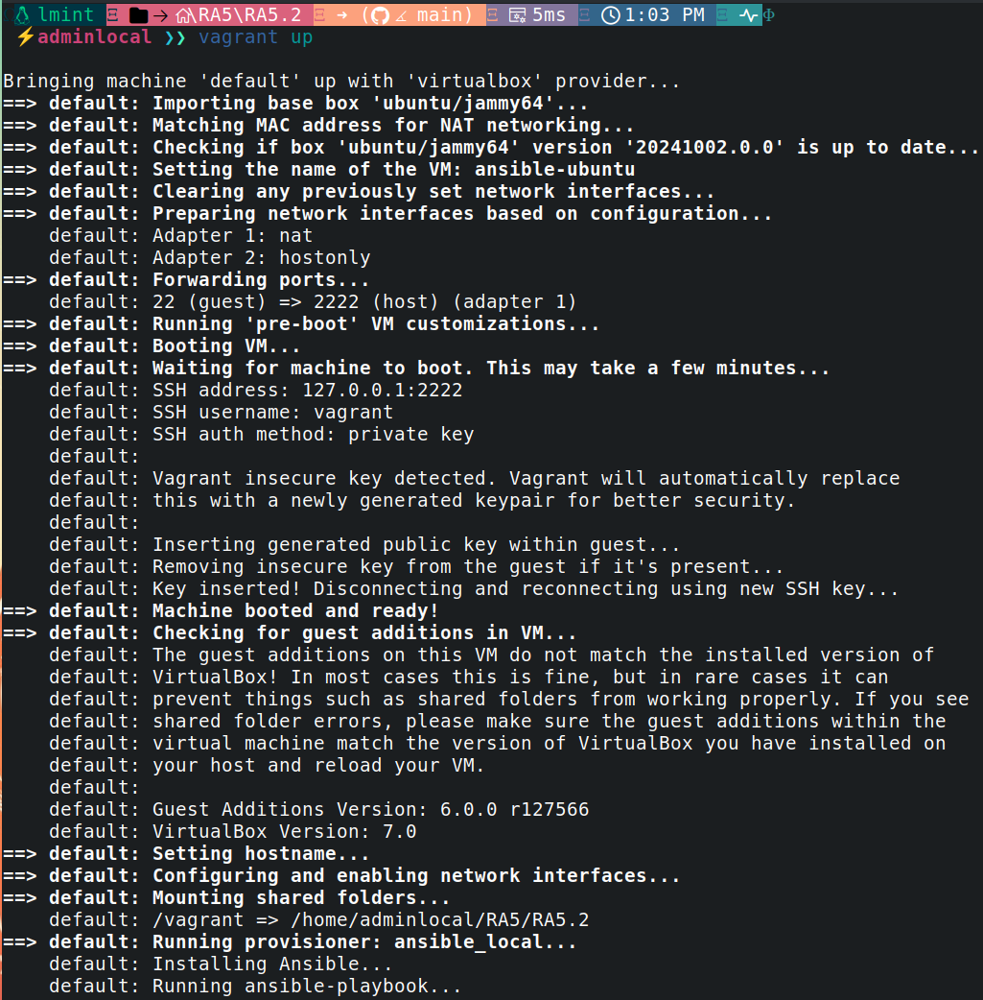
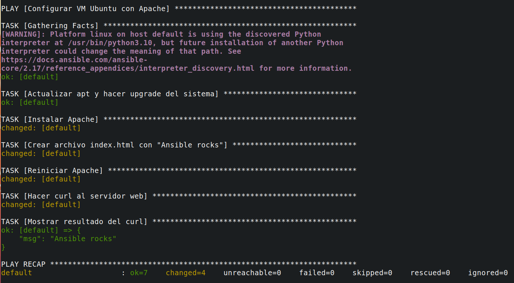
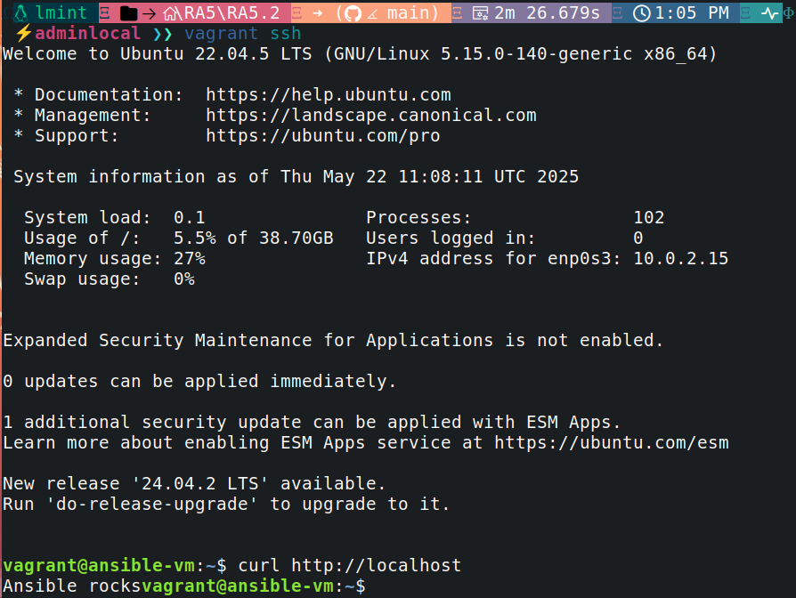
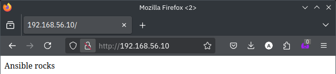

# RA5.2 - Aprovisionamiento de VM Ubuntu con Vagrant y Ansible

Este proyecto demuestra cómo provisionar una máquina virtual Ubuntu utilizando **Vagrant** y **Ansible**, con instalación automática de Apache y verificación de funcionamiento tanto desde terminal como navegador.

---

## ✅ Objetivo

- Crear una VM Ubuntu 22.04 con Vagrant y VirtualBox.
- Configurar la VM automáticamente con Ansible.
- Instalar el servicio Apache.
- Crear un archivo `index.html` con el mensaje `Ansible rocks`.
- Verificar el funcionamiento tanto por terminal como desde el navegador.

---

## 🛠️ Requisitos

- **VirtualBox**
- **Vagrant**
- **Ansible**
- Git

---

## 📁 Estructura del proyecto

```
RA5.2/
├── ansible/
│   └── playbook.yml           # Playbook de Ansible
├── assets/
│   ├── 1.png                  # vagrant up + instalación
│   ├── 2.png                  # tareas Ansible completadas
│   ├── 3.png                  # curl manual en VM
│   └── 4.png                  # navegador con "Ansible rocks"
├── Vagrantfile                # Configuración de la VM
└── README.md                  # Este documento
```

---

## 🚀 Instrucciones de uso

1. Clona este repositorio y entra en la carpeta `RA5.2`:

```bash
git clone https://github.com/PPS10752370/RA5.git
cd RA5/RA5.2
```

2. Lanza la máquina virtual:

```bash
vagrant up
```

Esto descargará la box `ubuntu/jammy64`, iniciará la máquina y ejecutará automáticamente el playbook de Ansible.

3. Verifica en el navegador (una vez finalizado):

```
http://192.168.56.10
```

Deberías ver en pantalla: **Ansible rocks**

---

## 🔍 Batería de pruebas

| Prueba | Descripción | Resultado esperado |
|-------|-------------|---------------------|
| `vagrant up` | Inicia y provisiona la VM con Apache y Ansible | Éxito en tareas de Ansible |
| `curl http://localhost` desde la VM | Verifica respuesta del servidor web | Devuelve `Ansible rocks` |
| `http://192.168.56.10` en navegador del host | Accede al servidor web desde fuera | Muestra `Ansible rocks` en HTML |
| `systemctl status apache2` (dentro de la VM) | Comprueba que Apache está activo | Estado `active (running)` |
| `cat /var/www/html/index.html` | Verifica que el contenido fue generado por Ansible | Contiene `Ansible rocks` |

---

## 📸 Evidencias

### 1️⃣ Lanzamiento de la VM y configuración inicial (`vagrant up`)


### 2️⃣ Playbook de Ansible completado correctamente


### 3️⃣ Resultado del `curl` desde dentro de la VM


### 4️⃣ Resultado visible en navegador web


---

## 🧑 Autor

Práctica realizada por **PPS10752370**
