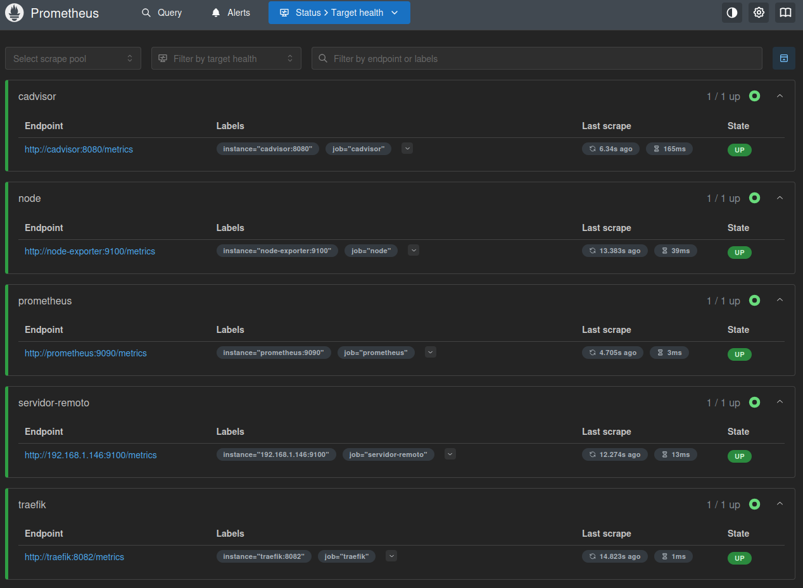

# Prometheus, Grafana y Node Exporter - Setup automatizado

Este repositorio es una adaptación del proyecto original de [dinesh24murali](https://github.com/dinesh24murali/example_repo/tree/main/prometheus_grafana_example), que ya incluye la configuración básica de Prometheus, Grafana y cAdvisor para monitorización de contenedores Docker.

## 📌 Requisitos previos

* Docker
* Docker Compose
* Acceso root o sudo
* Clonado del repositorio original

```bash
git clone https://github.com/dinesh24murali/example_repo.git
cd example_repo/prometheus_grafana_example
```

## 🛠️ Archivos a sustituir

Debes sustituir los siguientes archivos del repositorio clonado por los que están en este repositorio:

* `docker-compose.yml`
* `prometheus/prometheus.yml`

## ⚙️ Crear la red personalizada

Si no está creada, ejecuta:

```bash
docker network create --driver=bridge --subnet=172.30.0.0/16 mylocalnet
```

## 🧲 Instalar Node Exporter en servidor remoto

1. Descarga y descomprime Node Exporter:

```bash
wget https://github.com/prometheus/node_exporter/releases/download/v1.9.1/node_exporter-1.9.1.linux-amd64.tar.gz
```

2. Cópialo a `/usr/local/bin`:

```bash
sudo cp node_exporter-*/node_exporter /usr/local/bin/
```

3. Crea el servicio systemd:

```ini
# /etc/systemd/system/node_exporter.service
[Unit]
Description=Node Exporter
After=network.target

[Service]
User=root
ExecStart=/usr/local/bin/node_exporter

[Install]
WantedBy=default.target
```

4. Activa e inicia el servicio:

```bash
sudo systemctl daemon-reexec
sudo systemctl daemon-reload
sudo systemctl enable node_exporter
sudo systemctl start node_exporter
```

## 🚀 Levantar el stack de monitorización

Desde la carpeta donde tengas el nuevo `docker-compose.yml`:

```bash
docker compose up -d --build
```

---
## 📸 Explicación de capturas

### 1.png - Creación de la red

Se muestra la creación manual de la red Docker `mylocalnet` con `--subnet=172.30.0.0/16`.


---

### 2.png - Construcción e inicio del entorno

Se observan los pasos de `docker compose build` seguido de `up -d`, mostrando la descarga y arranque de contenedores correctamente.


---

### 3.png - cAdvisor funcionando

El contenedor cAdvisor está disponible en `http://localhost:8080`, mostrando información del sistema, procesos y uso de recursos en tiempo real.


---

### 4.png - Grafana levantado

Interfaz inicial de Grafana accediendo a `http://localhost:3000`. Aún sin data sources configuradas.


---

### 5.png - Prometheus operando

Prometheus está funcionando en `http://localhost:9090`, mostrando una gráfica con las peticiones HTTP recibidas por códigos 2XX.


---

### 6.png - Node Exporter como servicio

El servicio `node_exporter` está activo como daemon de systemd. Muestra que está escuchando correctamente en el puerto 9100.


---

### 7.png - Estado de targets Prometheus

Todos los targets configurados (cadvisor, node, prometheus, servidor remoto y traefik) están en estado UP.



---

### 8.png - Panel en Grafana

Ejemplo de un panel con la métrica `node_cpu_seconds_total`, mostrando el uso de CPU del servidor remoto segmentado por modo de uso (user, system, idle...).


---

## 📖 Referencias

* [https://prometheus.io/docs/introduction/overview/](https://prometheus.io/docs/introduction/overview/)
* [https://grafana.com/docs/grafana/latest/](https://grafana.com/docs/grafana/latest/)
* [https://github.com/google/cadvisor](https://github.com/google/cadvisor)
* [https://github.com/prometheus/node\_exporter](https://github.com/prometheus/node_exporter)
	
